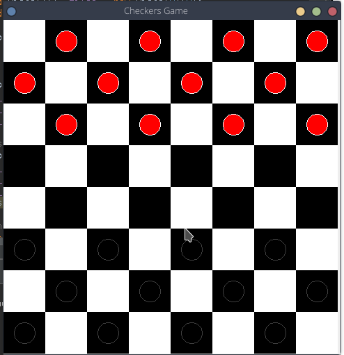

# CheckPacito
- A checkers game in java.
- It uses JFrame and graphics.

## Game screenshot

### What works
- Piece movement
- Piece capture
- Capture gives one more turn to who did it

### What doesn't work
- Who won the game
- King capture
- Piece is obligated to capture if there is a scenario in which it's possible to capture
